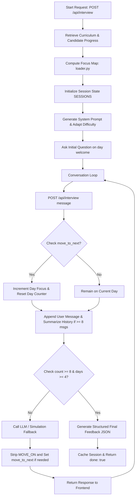

# 🎙️ AI Technical Interviewer Agent

A production-grade, state-of-the-art FastAPI backend service and glassmorphic single-page web UI designed for technical evaluations. The agent simulates multi-turn, adaptive technical interviews probing candidates on their Boot Camp learning journey, adjusting questions dynamically based on completed milestones, skipped days, and attempts.

---

## 🏗️ System Architecture

The following diagram illustrates the lifecycle of a technical interview session, mapping candidate focus calculations, API loops, history summarization, and final evaluators.



---

## 🛠️ Configuration Settings

The application reads configurations from environment variables or a local `.env` file. You can swap the completions engine to target OpenAI, DeepSeek, or any local OpenAI-compatible endpoint (like Ollama or LM Studio) with zero code modifications.

| Variable Name | Required | Default | Description |
| :--- | :---: | :--- | :--- |
| `OPENAI_API_KEY` | **Yes** | — | API credentials for the LLM completions and evaluator. |
| `OPENAI_BASE_URL` | *No* | Standard OpenAI | URL endpoint targeting compatible providers (e.g. DeepSeek / local Ollama). |
| `OPENAI_MODEL_NAME` | *No* | `gpt-4o-mini` | Model identifier to query for questions and final evaluations. |

---

## 🚀 Getting Started

### 1. Installation
Ensure Python 3.8+ is installed on your local system:

```bash
# Set up and activate virtual environment
python -m venv .venv
source .venv/bin/activate  # On Windows use: .venv\Scripts\activate

# Install pinned dependencies
pip install -r requirements.txt
```

### 2. Configure Environment Variables
Create a `.env` file matching the template:
```bash
cp .env.example .env
```
Fill in your API credentials:
```ini
OPENAI_API_KEY=your_actual_api_key_here
# Optional customization:
# OPENAI_BASE_URL=https://api.deepseek.com/v1
# OPENAI_MODEL_NAME=deepseek-chat
```

### 3. Running the Server
Start the Uvicorn development server:
```bash
uvicorn app.main:app --host 127.0.0.1 --port 8000 --reload
```

* **Frontend User Interface**: Open [http://127.0.0.1:8000/](http://127.0.0.1:8000/) in your web browser.
* **Interactive Swagger Documentation**: Browse [http://127.0.0.1:8000/docs](http://127.0.0.1:8000/docs).

### 4. Running the Validation Suite
Execute the unit and integration tests:

```bash
# Run pytest suite
python -m pytest

# Run compliance contract test report
python scratch/run_compliance_report.py
```

---

## 🧠 Core Abstractions & Algorithms

### 1. Dynamic Focus Mapping (`app/loader.py`)
At the start of an interview, `build_focus_map` parses the candidate's learning history and scores risk per curriculum day:
- **Skipped Day (`risk_score: 10`)**: High priority focus topic.
- **Failed Day (`risk_score: 8`)**: High priority focus topic.
- **Struggled Day (>= 3 attempts) (`risk_score: 6`)**: Medium priority focus topic.
- **First Try Pass (`risk_score: 1`)**: Low priority (candidate demonstrates mastery).

The engine automatically ensures that at least **4 focus days** spanning at least **3 modules** are targeted to guarantee curriculum coverage.

### 2. Context Window Management (`summarize_history`)
As conversations grow, they consume more tokens. To maintain a lightweight footprint, the agent implements a sliding window context-summarizer:
- When the conversation history size reaches **8 messages (4 turns)**, the earliest **4 messages** are serialized.
- The LLM summarizes this context into a concise `running_summary`.
- The summarized messages are pruned from the active history list, and the `running_summary` is appended to the system prompt of subsequent calls.

### 3. Difficulty Adaptation
The agent adjusts the depth of the questions based on the candidate's history:
* **High Priority (Skipped/Failed)**: Probes basic/conceptual understandings.
* **Medium Priority (Struggled)**: Focuses on implementation details and practical caveats.
* **Low Priority (Mastery)**: Asks advanced, architectural, and design trade-off questions.

---

## 📡 Interactive Developer Practice cURL Sequence

You can test the entire multi-turn technical interview lifecycle using these cURL commands:

### 1. Initialize Interview (Start Turn)
Initialize a new session with candidate data.

```bash
curl -X POST "http://127.0.0.1:8000/api/interview" \
     -H "Content-Type: application/json" \
     -d '\''{
       "sessionId": "candidate-practice-101",
       "candidate": {
         "member": {
           "id": "CAND-014",
           "name": "Bethany Cole",
           "jobRole": "HR Manager",
           "yearsExperience": 10,
           "education": "BA Human Resources",
           "status": "COMPLETED"
         },
         "missions": [
           { "day": 1, "title": "VS Code & Python Environment Setup", "passed": true, "attempts": 4 },
           { "day": 7, "title": "Embeddings Explained", "passed": true, "attempts": 5 },
           { "day": 8, "title": "Vector Databases Overview", "skipped": true },
           { "day": 12, "title": "Prompt Engineering Fundamentals", "passed": true, "attempts": 5 },
           { "day": 16, "title": "Chatbot Backend & API Integration", "passed": true, "attempts": 4 },
           { "day": 20, "title": "Conversation Memory & Context Management", "passed": true, "attempts": 3 },
           { "day": 22, "title": "Multi-Agent Orchestration", "skipped": true },
           { "day": 27, "title": "Security, Privacy & Guardrails", "skipped": true },
           { "day": 28, "title": "Docker & Kubernetes Deployment", "skipped": true },
           { "day": 31, "title": "Capstone Project & Final Demo", "passed": true, "attempts": 4 }
         ],
         "signals": {
           "commitDays": 17,
           "missionsCompleted": 20,
           "missionsFirstTry": 1
         }
       }
     }'\''
```

**Expected Response:**
```json
{
  "reply": "Welcome. Let'\''s begin your interview. I see you skipped the vector databases overview module. Can you explain why a system needs a vector database instead of a traditional SQL database for semantic queries?",
  "done": false
}
```

---

### 2. Intermediate Conversations (Turns 2 to 7)
Each time, send the user response back to the API.

```bash
curl -X POST "http://127.0.0.1:8000/api/interview" \
     -H "Content-Type: application/json" \
     -d '\''{
       "sessionId": "candidate-practice-101",
       "message": "We need vector databases because standard database indexes cannot efficiently compute high-dimensional distance searches."
     }'\''
```

**Expected Response:**
```json
{
  "reply": "That is correct. How do parameters like `ef_construction` in HNSW indices affect query latency versus retrieval recall? [MOVE_ON]",
  "done": false
}
```

---

### 3. Concluding Turn (Turn 8+)
Once 8 questions have been asked covering at least 4 curriculum days, the final turn generates structured feedback.

```bash
curl -X POST "http://127.0.0.1:8000/api/interview" \
     -H "Content-Type: application/json" \
     -d '\''{
       "sessionId": "candidate-practice-101",
       "message": "Increasing ef_construction makes the HNSW graph construction slower but improves the accuracy and query recall."
     }'\''
```

**Expected Response:**
```json
{
  "reply": "Interview completed.",
  "done": true,
  "feedback": {
    "summary": "The candidate has demonstrated a solid grasp of vector database theory despite skipping the core module.",
    "strengths": [
      "Explain indexing structures (HNSW) from Day 8 with high clarity."
    ],
    "gaps": [
      "Struggled with the deployment optimization pipeline configurations from Day 1."
    ],
    "next": [
      "Review the objectives of Day 1 and optimize Docker builds."
    ]
  }
}
```

---

### 4. Cache Evaluation Fetching
If you submit a message *after* the interview is marked completed, the agent returns the cached evaluation directly:

```bash
curl -X POST "http://127.0.0.1:8000/api/interview" \
     -H "Content-Type: application/json" \
     -d '\''{
       "sessionId": "candidate-practice-101",
       "message": "Is there anything else?"
     }'\''
```

**Expected Response:**
```json
{
  "reply": "Interview completed.",
  "done": true,
  "feedback": {
    "summary": "The candidate has demonstrated a solid grasp of vector database theory despite skipping the core module.",
    "strengths": [
      "Explain indexing structures (HNSW) from Day 8 with high clarity."
    ],
    "gaps": [
      "Struggled with the deployment optimization pipeline configurations from Day 1."
    ],
    "next": [
      "Review the objectives of Day 1 and optimize Docker builds."
    ]
  }
}
```
